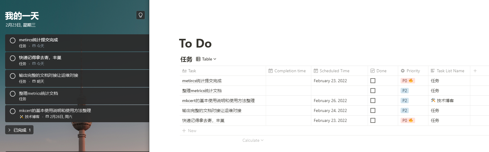
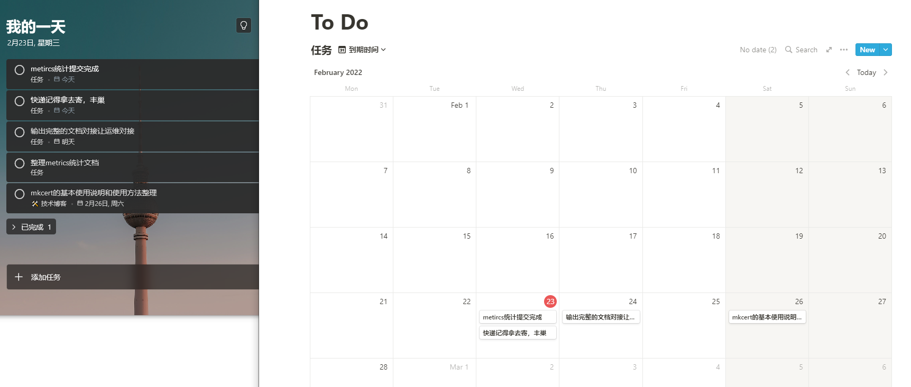

# 功能

主要想实现 Microsoft To Do 定时1min内更到 notion， 解决 Microsoft To Do 无法和日历集成问题

使用Notion支持高特性的过滤排序条件等


## 参考文档
https://developers.notion.com/docs

https://docs.microsoft.com/zh-cn/graph/api/resources/todo-overview?view=graph-rest-1.0

## 功能

## 定期同步效果图



## 支持notion自定义过滤




## 使用方式

- 获取notion相关api权限和key
- 获取Microsoft Todo 相关权限和key

```bash
NAME:
   sync - todo sync notion!

USAGE:
   main [global options] command [command options] [arguments...]

COMMANDS:
   help, h  Shows a list of commands or help for one command

GLOBAL OPTIONS:
   --notionSecret value, --ns value       notion secret
   --notionDatabaseID value, --nd value   notion databaseID
   --todoClientID value, --tc value       todo clientID
   --todoClientSecret value, --tcs value  todo client secret
   --help, -h                             show help (default: false)
```


- 编译完使用命令行运维

```bash
notionSync --notionSecret secret_xxxxxxxxxxx --notionDatabaseID xxxxxxxxx --todoClientID xxxxx --todoClientSecret xxxxxxxx
```

